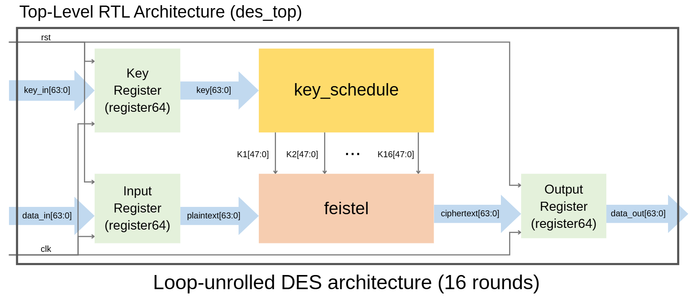
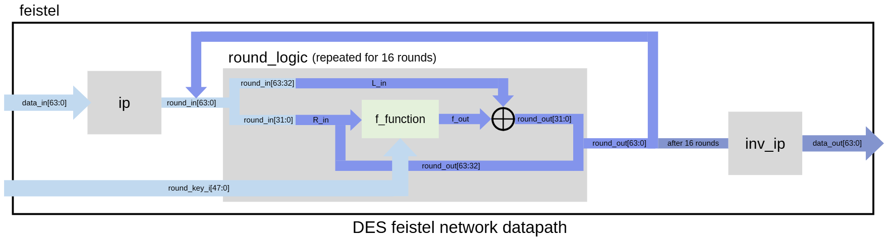
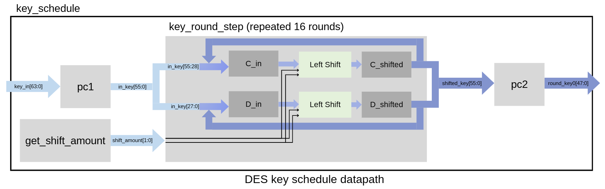
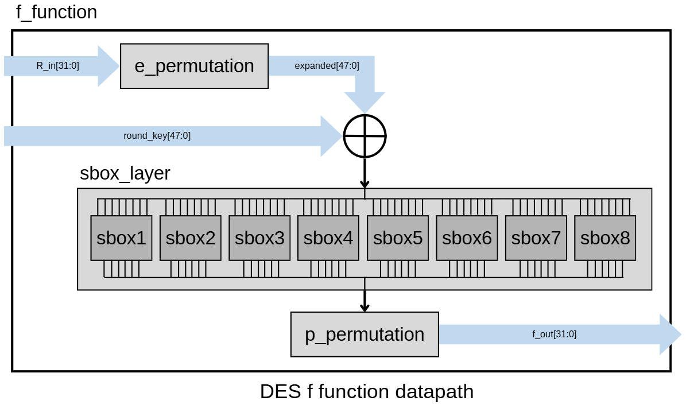

# DES in Verilog

Hardware implementation of the Data Encryption Standard (DES) in Verilog, covering the complete digital design flow from RTL through synthesis, place & route, and post-route timing simulation. The design implements a 16-round loop-unrolled Feistel architecture with full modular decomposition of the key schedule, permutations, and S-box substitution logic. Verified against known DES reference vectors using self-checking testbenches driven by a custom Python-based test vector generation workflow. Post-synthesis results on an Artix-7 FPGA reach ~55 MHz using ~1455 LUTs.

---

## What This Project Demonstrates

- RTL implementation of a non-trivial cryptographic algorithm
- Modular hardware decomposition: key schedule, permutations, S-box substitution
- Reference-driven verification methodology using externally generated test vectors
- Full design flow: RTL → simulation → synthesis → place & route → post-route timing validation
- Python-based automation for verification data preparation
- Systematic debugging using bit-level analysis

---

## Architecture Overview

### System-Level Design

[](docs/architecture/des_encryption_block_diagram.png)

The top-level module `des_top` integrates:
- `key_schedule` — generates the 16 round subkeys
- `feistel` — performs the 16-round Feistel network
- Internal registers for input, key, and output

---

### Feistel Network

[](docs/architecture/des_feistel_network.png)

RTL modules map directly to the DES Feistel structure:
- `ip` — initial permutation
- `round_logic` — round-level transformation
- `f_function` — core nonlinear round function
- `inv_ip` — final permutation

---

### Key Schedule

[](docs/architecture/des_key_schedule.png)

The key schedule is decomposed into:
- `pc1` — initial key permutation
- `key_round_step` — per-round shift logic
- `pc2` — subkey extraction

---

### f-function

[](docs/architecture/des_f_function.png)

The round function pipeline:
- `e_permutation` — expansion from 32 to 48 bits
- `sbox_layer` — nonlinear substitution via 8 S-boxes (`sbox1`–`sbox8`)
- `p_permutation` — final permutation stage

---

## Verification

The design is verified using self-checking testbenches driven by externally generated reference vectors.

The verification flow includes:
- Known DES reference vectors
- Module-level verification using parsed intermediate DES states
- Automatic output comparison with PASS/FAIL reporting

### Test Vector Generation

A Python-based workflow generates and validates DES test vectors using a trusted external DES reference (JS-DES). Intermediate round values are extracted, normalized, and converted into Verilog-compatible testbench inputs — enabling both module-level and system-level coverage without reliance on manually written test data.

Details in `docs/test_vectors/README.md`.

### Debugging Example

During verification, a systematic bit-level mismatch was observed across simulation outputs. Converting hex to binary revealed a consistent inversion pattern (0 → 1, 1 → 0), which immediately narrowed the search space to permutation stages rather than functional logic. The root cause was an incorrect bit-ordering in one permutation block. Correcting it resolved all mismatches.

This is a good example of how recognizing a systematic error pattern — rather than debugging the full data path — significantly reduces debugging time.

---

## Results

- Functional simulation: **PASS** (RTL and post-P&R)
- Encryption output matches known DES reference vectors

The design is implemented as a loop-unrolled combinational datapath — all 16 Feistel rounds are instantiated explicitly, with registers only at the input and output boundaries. The critical path traverses all 16 rounds, which accounts for the ~55 MHz Fmax.

### FPGA Implementation (Artix-7)

| Metric | Value |
|---|---|
| Fmax (post-synthesis) | ~55 MHz |
| LUTs | ~1455 |
| Flip-flops | ~184 |

Detailed reports in `docs/reports/`.

---

## Simulation

Simulation is performed using ModelSim. Run the full flow with:

```
vsim -do sim/run.do
```

This compiles all RTL and testbench files, loads waveforms, and runs simulation to completion.

---

## Alternative Integration Wrapper

`des_top_wrapper` is an optional module for reduced-I/O integration scenarios. It loads the 64-bit key and input block through a 32-bit shared bus using a selector interface, and provides serialized access to the 64-bit output — useful for FPGA targets where exposing full 64-bit interfaces is not practical.

---

## Project Structure

```
src/   RTL implementation (des_top and submodules, optional wrapper)
tb/    Verification environment (module-level and top-level testbenches)
sim/   ModelSim simulation scripts
docs/  Reports, presentation, architecture diagrams, test vector tooling
```

---

## Project Context

Developed as part of the course **"Cryptography Algorithms and Verilog Implementation"**. The assignment required implementing DES in Verilog and demonstrating a complete digital design flow including RTL simulation, synthesis, P&R, and post-P&R timing simulation.

AI tools were used to generate initial RTL code. The generated code was frequently incomplete or incorrect and required significant manual work: debugging functional errors, fixing logic, resolving integration issues, and building the full verification infrastructure independently.

---

## Credits

Developed by Runi Zukerman and David Orlian.